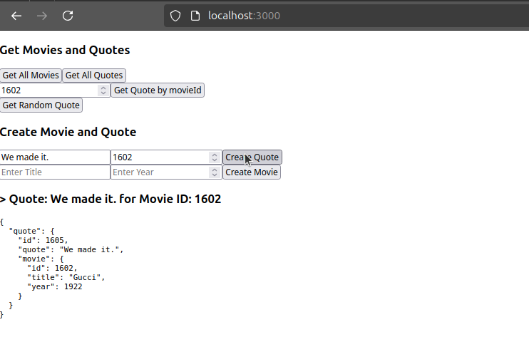

115304
# Lab 04 - Full Stack Spring Boot with ReactJS

In this lab, we will explore front-end development using **ReactJS** with **TypeScript** to gain a deeper understanding of building user interfaces. TypeScript is a superset of JavaScript that adds optional static typing and other features to the language. ReactJS is a JavaScript library for building user interfaces, maintained by Facebook and a community of individual developers and companies.

## Table of Contents
1. [First Dummy App](#first-dummy-app)
2. [Props and State](#props-and-state)
3. [Passing Data Deeply with Context](#passing-data-deeply-with-context)
4. [Tic-Tac-Toe Game](#tic-tac-toe-game)
5. [Consume REST API Services - Fetch and Axios Usage in React](#consume-rest-api-services---fetch-and-axios-usage-in-react)
6. [Wrapping Up and Integrating Concepts](#wrapping-up-and-integrating-concepts)

---

## First Dummy App

We will create a simple ReactJS app that displays a list of movies. We'll use the `create-react-app` command-line tool to set up our application in a new directory called `my-app`.

```bash
npx create-react-app my-app --template typescript
```

### Modifying `App.tsx`

Next, we'll modify the `App.tsx` file to create a simple dummy app. We'll define an interface to store our button properties and then create a button component that displays the number of times it has been clicked.

```typescript
interface MyButtonProps {
  count: number;
  onClick: () => void;
}

function MyButton({ count, onClick }: MyButtonProps) {
  return (
    <button onClick={onClick}>
      Clicked {count} times
    </button>
  );
}

function AboutPage() {
  return (
    <>
      <h1>About</h1>
      <p>
        Hello there.<br />
        How do you do?
      </p>
    </>
  );
}
```

To incorporate the button into the app, we'll use the `useState` hook to store the number of times the button has been clicked.

```typescript
const [count, setCount] = useState(0);

function handleClick() {
  setCount(count + 1);
}
```

### Adding Components

We can enhance our app by adding additional components, such as a profile picture and a shopping list. We'll create the `Profile` and `ShoppingList` components in separate files and store them in the `components/` directory.

#### `Profile` Component

```typescript
const user = {
  name: 'Hedy Lamarr',
  imageUrl: 'https://i.imgur.com/yXOvdOSs.jpg',
  imageSize: 90,
};

export default function Profile() {
  return (
    <>
      <h1>{user.name}</h1>
      
    </>
  );
}
```

#### `ShoppingList` Component

```typescript
const products = [
  { title: 'Cabbage', isFruit: false, id: 1 },
  { title: 'Garlic', isFruit: false, id: 2 },
  { title: 'Apple', isFruit: true, id: 3 },
];

export default function ShoppingList() {
  const listItems = products.map((product) => (
    <li
      key={product.id}
      style={{
        color: product.isFruit ? 'magenta' : 'darkgreen',
      }}
    >
      {product.title}
    </li>
  ));

  return <ul>{listItems}</ul>;
}
```

### Updating `App.tsx`

Finally, we'll add the components to the `App.tsx` file.

```typescript
function MyApp() {
  const [count, setCount] = useState(0);

  function handleClick() {
    setCount(count + 1);
  }

  return (
    <>
      
      <AboutPage />
      <div>
        <h1>Welcome to my app</h1>
        <div>
          <h1>Counters that update together</h1>
          <MyButton count={count} onClick={handleClick} />
          <MyButton count={count} onClick={handleClick} />
        </div>
      </div>
      <Profile />
      <ShoppingList />
    </>
  );
}

export default MyApp;
```

### Running the App

To run the app, use the following command:

```bash
npm start
```

The app will be available at `http://localhost:3000/`.

**Result:**


---

## Props and State

### Passing Props to a Component & Updating Objects in State

Props are used to pass data from a parent component to a child component in React. The child component can then use these props to render the data. Additionally, state is used to store data that can change over time. The state is managed by the component itself and can be updated using the `useState` hook.

In the following example, the `Avatar` component accepts a `person` prop and renders the person's name and image. The `MovingDot` component uses the `useState` hook to update the position of a red dot based on the mouse pointer's position.

#### `Profile` Component

The `Profile` component renders a profile card with an avatar and a moving dot. It uses the `Avatar`, `Card`, and `MovingDot` components.

```typescript
export default function Profile() {
  return (
    <>
      <Card>
        <Avatar
          size={100}
          person={{
            name: 'Katsuko Saruhashi',
            imageId: 'YfeOqp2',
          }}
        />
      </Card>
      <MovingDot />
    </>
  );
}
```

#### `Avatar` Component

The `Avatar` component displays an avatar image. It accepts `person` and `size` as props.

```typescript
interface AvatarProps {
  person: {
    name: string;
    imageId: string;
  };
  size?: number;
}

export default function Avatar({ person, size = 100 }: AvatarProps) {
  return (
    
  );
}
```

#### `Card` Component

The `Card` component wraps its children in a styled card.

```typescript
import { ReactNode } from 'react';

export default function Card({ children }: { children: ReactNode }) {
  return <div className="card">{children}</div>;
}
```

#### `MovingDot` Component

The `MovingDot` component displays a red dot that follows the mouse pointer.

```typescript
import { useState } from 'react';

export default function MovingDot() {
  const [position, setPosition] = useState({
    x: 0,
    y: 0,
  });

  return (
    <div
      onPointerMove={(e) => {
        setPosition({
          x: e.clientX,
          y: e.clientY,
        });
      }}
      style={{
        position: 'relative',
        width: '100vw',
        height: '100vh',
      }}
    >
      <div
        style={{
          position: 'absolute',
          backgroundColor: 'red',
          borderRadius: '50%',
          transform: `translate(${position.x}px, ${position.y}px)`,
          left: -10,
          top: -10,
          width: 20,
          height: 20,
        }}
      />
    </div>
  );
}
```

### Running the App

To run the app, use the following command:

```bash
npm start
```

The app will be available at `http://localhost:3000/`.

**Result:**


---

## Passing Data Deeply with Context

React's Context API allows data to be passed through the component tree without having to pass props down manually at every level.

### `LevelContext`

The `LevelContext` is a React context that provides the current heading level to its consumers. It is used to dynamically determine the heading level (`<h1>`, `<h2>`, etc.) based on the nesting level of the `Section` components.

```typescript
import { createContext } from 'react';

export const LevelContext = createContext(0);
```

### `Section` Component

The `Section` component increments the heading level for its children. It uses the `LevelContext` to determine the current heading level and provides the incremented level to its children.

```typescript
import { ReactNode, useContext } from 'react';
import { LevelContext } from './LevelContext';

export default function Section({ children }: { children: ReactNode }) {
  const level = useContext(LevelContext);
  return (
    <section className="section">
      <LevelContext.Provider value={level + 1}>
        {children}
      </LevelContext.Provider>
    </section>
  );
}
```

### `Heading` Component

The `Heading` component renders a heading element (`<h1>`, `<h2>`, etc.) based on the current heading level provided by the `LevelContext`.

```typescript
import { ReactNode, useContext } from 'react';
import { LevelContext } from './LevelContext';

export default function Heading({ children }: { children: ReactNode }) {
  const level = useContext(LevelContext);

  switch (level) {
    case 1:
      return <h1>{children}</h1>;
    case 2:
      return <h2>{children}</h2>;
    case 3:
      return <h3>{children}</h3>;
    case 4:
      return <h4>{children}</h4>;
    case 5:
      return <h5>{children}</h5>;
    case 6:
      return <h6>{children}</h6>;
    default:
      throw new Error('Unknown level: ' + level);
  }
}
```

### `App` Component

The `App` component uses the `Section` and `Heading` components to create a nested structure of headings.

```typescript
import { LevelContext } from './LevelContext';
import Section from './Section';
import Heading from './Heading';

export default function App() {
  return (
    <LevelContext.Provider value={1}>
      <Section>
        <Heading>Section 1</Heading>
        <Section>
          <Heading>Section 1.1</Heading>
          <Section>
            <Heading>Section 1.1.1</Heading>
          </Section>
        </Section>
        <Section>
          <Heading>Section 1.2</Heading>
        </Section>
      </Section>
      <Section>
        <Heading>Section 2</Heading>
      </Section>
    </LevelContext.Provider>
  );
}
```

### Running the App

To run the app, use the following command:

```bash
npm start
```

The app will be available at `http://localhost:3000/`.

**Result:**


---

## Tic-Tac-Toe Game

To further understand ReactJS concepts, we'll create a simple tic-tac-toe game with a 6x6 grid.

### Application Structure

The Tic-Tac-Toe game consists of the following components:

- **`App.tsx` (Game):** The main component that manages the game state and renders the `Board` component and the list of moves.
- **`Board.tsx`:** Renders the tic-tac-toe board and handles the click events for each square.
- **`Square.tsx`:** Renders a single square on the tic-tac-toe board.

### `App` Component

The `App` component (named `Game` in this context) manages the game state, including the history of moves, the current move, and the current player. It also renders the `Board` component and the list of moves.

```typescript
import { useState } from 'react';
import Board from './components/Board';

function Game() {
  const [history, setHistory] = useState([Array(6 * 6).fill(null)]);
  const [currentMove, setCurrentMove] = useState(0);
  const xIsNext = currentMove % 2 === 0;
  const currentSquares = history[currentMove];
  const boardWidth = 6;

  function handlePlay(nextSquares: string[]) {
    const nextHistory = [...history.slice(0, currentMove + 1), nextSquares];
    setHistory(nextHistory);
    setCurrentMove(nextHistory.length - 1);
  }

  function jumpTo(nextMove: number) {
    setCurrentMove(nextMove);
  }

  const moves = history.map((squares, move) => {
    const description = move > 0 ? 'Go to move #' + move : 'Go to game start';
    return (
      <li key={move}>
        <button onClick={() => jumpTo(move)}>{description}</button>
      </li>
    );
  });

  return (
    <div className="game">
      <div className="game-board">
        <Board
          boardWidth={boardWidth}
          xIsNext={xIsNext}
          squares={currentSquares}
          onPlay={handlePlay}
        />
      </div>
      <div className="game-info">
        <ol>{moves}</ol>
      </div>
    </div>
  );
}

export default Game;
```

### File Structure

```
src/
├── components/
│   ├── Board.tsx
│   └── Square.tsx
├── App.tsx
├── index.tsx
...
```

### Running the App

To run the app, use the following command:

```bash
npm start
```

The app will be available at `http://localhost:3000`.

---

## Consume REST API Services - Fetch and Axios Usage in React

In this section, we'll explain how to use both `fetch` and `axios` to make HTTP requests in a React application. We'll discuss the differences between them and how `async` and `await` are used to handle asynchronous operations.

### Fetch API

The `fetch` API is a built-in JavaScript function that allows you to make HTTP requests. It returns a promise that resolves to the response of the request.

#### Example: Using Fetch in a React Component

```typescript
import { useState, useEffect } from 'react';

interface Post {
  userId?: number;
  id?: number;
  title: string;
  body: string;
}

interface FormEvent {
  preventDefault: () => void;
}

const AppFetch = () => {
  const [posts, setPosts] = useState<Post[]>([]);
  const [title, setTitle] = useState('');
  const [body, setBody] = useState('');

  // GET with fetch API
  useEffect(() => {
    const fetchPost = async () => {
      const response = await fetch('https://jsonplaceholder.typicode.com/posts?_limit=5');
      const data = await response.json();
      setPosts(data);
    };
    fetchPost();
  }, []);

  // DELETE with fetch API
  const deletePost = async (id: number) => {
    const response = await fetch(`https://jsonplaceholder.typicode.com/posts/${id}`, {
      method: 'DELETE',
    });
    if (response.status === 200) {
      setPosts(posts.filter((post) => post.id !== id));
    }
  };

  // POST with fetch API
  const addPosts = async (title: string, body: string): Promise<void> => {
    const response = await fetch('https://jsonplaceholder.typicode.com/posts', {
      method: 'POST',
      body: JSON.stringify({
        title,
        body,
        userId: Math.random().toString(36).slice(2),
      }),
      headers: {
        'Content-type': 'application/json; charset=UTF-8',
      },
    });
    const data: Post = await response.json();
    setPosts((posts) => [data, ...posts]);
    setTitle('');
    setBody('');
  };

  const handleSubmit = (e: FormEvent) => {
    e.preventDefault();
    addPosts(title, body);
  };

  return (
    <div>
      <h1>Posts</h1>
      <form onSubmit={handleSubmit}>
        <input
          type="text"
          placeholder="Title"
          value={title}
          onChange={(e) => setTitle(e.target.value)}
        />
        <textarea
          placeholder="Body"
          value={body}
          onChange={(e) => setBody(e.target.value)}
        />
        <button type="submit">Add Post</button>
      </form>
      <ul>
        {posts.map((post) => (
          <li key={post.id}>
            <h2>{post.title}</h2>
            <p>{post.body}</p>
            {post.id !== undefined && (
              <button onClick={() => deletePost(post.id)}>Delete</button>
            )}
          </li>
        ))}
      </ul>
    </div>
  );
};

export default AppFetch;
```

### Axios

`axios` is a popular third-party library for making HTTP requests. It provides a more powerful and flexible API compared to the built-in `fetch` API.

#### Example: Using Axios in a React Component

```typescript
import React, { useEffect, useState } from 'react';
import axios from 'axios';

interface Post {
  userId?: number;
  id?: number;
  title: string;
  body: string;
}

interface FormEvent {
  preventDefault: () => void;
}

const App: React.FC = () => {
  const [posts, setPosts] = useState<Post[]>([]);
  const [title, setTitle] = useState('');
  const [body, setBody] = useState('');

  const client = axios.create({
    baseURL: 'https://jsonplaceholder.typicode.com/posts',
  });

  // GET with Axios
  useEffect(() => {
    const fetchPost = async () => {
      const response = await client.get('?_limit=5');
      setPosts(response.data);
    };
    fetchPost();
  }, []);

  // DELETE with Axios
  const deletePost = async (id: number) => {
    await client.delete(`${id}`);
    setPosts(posts.filter((post) => post.id !== id));
  };

  // POST with Axios
  const addPosts = async (title: string, body: string): Promise<void> => {
    const response = await client.post<Post>('', {
      title,
      body,
    });
    setPosts((posts) => [response.data, ...posts]);
    setTitle('');
    setBody('');
  };

  const handleSubmit = (e: FormEvent) => {
    e.preventDefault();
    addPosts(title, body);
  };

  return (
    <div>
      <h1>Posts</h1>
      <form onSubmit={handleSubmit}>
        <input
          type="text"
          placeholder="Title"
          value={title}
          onChange={(e) => setTitle(e.target.value)}
        />
        <textarea
          placeholder="Body"
          value={body}
          onChange={(e) => setBody(e.target.value)}
        />
        <button type="submit">Add Post</button>
      </form>
      <ul>
        {posts.map((post) => (
          <li key={post.id}>
            <h2>{post.title}</h2>
            <p>{post.body}</p>
            {post.id !== undefined && (
              <button onClick={() => deletePost(post.id)}>Delete</button>
            )}
          </li>
        ))}
      </ul>
    </div>
  );
};

export default App;
```

### Differences Between Fetch and Axios

- **Syntax and Ease of Use:**
  - `fetch` is a built-in JavaScript function and does not require any additional libraries. However, it has a more verbose syntax and requires manual handling of JSON responses and errors.
  - `axios` is a third-party library that provides a simpler and more intuitive API for making HTTP requests. It automatically handles JSON responses and errors.

- **Error Handling:**
  - `fetch` does not throw an error for HTTP error statuses (e.g., 404, 500). You need to manually check the response status and throw an error if necessary.
  - `axios` automatically throws an error for HTTP error statuses, making error handling easier.

- **Request and Response Interceptors:**
  - `fetch` does not have built-in support for interceptors, but you can achieve similar functionality by wrapping `fetch` in a custom function.
  - `axios` provides built-in support for request and response interceptors, allowing you to modify requests or responses before they are handled.

- **Browser Compatibility:**
  - `fetch` is supported in modern browsers but may require a polyfill for older browsers.
  - `axios` works in all modern browsers and Node.js environments.

### Using `async` and `await`

`async` and `await` are JavaScript keywords that simplify working with promises and asynchronous code. They allow you to write asynchronous code that looks and behaves like synchronous code.

- **`async`:** Declares an asynchronous function. The function returns a promise, and you can use `await` inside it.
- **`await`:** Pauses the execution of an `async` function until the promise is resolved or rejected. It can only be used inside `async` functions.

**Example:**

```typescript
async function fetchData() {
  try {
    const response = await fetch('https://jsonplaceholder.typicode.com/posts');
    const data = await response.json();
    console.log(data);
  } catch (error) {
    console.error('Error fetching data:', error);
  }
}

fetchData();
```

In this example, `fetchData` is an asynchronous function that uses `await` to pause execution until the `fetch` promise is resolved. If an error occurs, it is caught and logged to the console.

---

## Wrapping Up and Integrating Concepts

### Full Stack App: Movies and Quotes

This full-stack application allows users to manage movies and quotes. The frontend is built with React, and the backend is built with Spring Boot. The application uses PostgreSQL as the database and Docker Compose to manage the services.

#### File Structure

```
Lab04_4/
├── docker-compose.yml
├── frontend-quotes/
│   ├── Dockerfile
│   ├── src/
│   │   ├── App.tsx
│   │   ├── components/
│   │   │   ├── MoviesRecord.tsx
│   │   │   └── QuotesRecord.tsx
│   │   ├── consumers/
│   │   │   └── apiConsumer.tsx
│   │   ├── index.tsx
│   │   └── ...
│   └── ...
├── quotes/
│   ├── Dockerfile
│   ├── src/
│   │   ├── main/
│   │   │   ├── java/
│   │   │   │   └── ies/
│   │   │   │       └── lab/
│   │   │   │           └── quotes/
│   │   │   │               ├── QuotesApplication.java
│   │   │   │               ├── controllers/
│   │   │   │               ├── entities/
│   │   │   │               ├── exceptions/
│   │   │   │               ├── repositories/
│   │   │   │               └── services/
│   │   └── ...
│   └── ...
└── .env
```

#### Docker Compose Configuration

```yaml
version: '3.8'

services:
  postgres:
    image: postgres:12
    container_name: postgres
    env_file: ./.env
    environment:
      POSTGRES_USER: ${POSTGRES_USER}
      POSTGRES_PASSWORD: ${POSTGRES_PASSWORD}
      POSTGRES_DB: ${POSTGRES_DB}
    ports:
      - "${POSTGRES_LOCAL_PORT}:${POSTGRES_DOCKER_PORT}"
    restart: always

  quotes:
    depends_on:
      - postgres
    build: ./quotes
    env_file: ./.env
    ports:
      - "${QUOTES_LOCAL_PORT}:${QUOTES_DOCKER_PORT}"
    environment:
      SPRING_APPLICATION_JSON: >-
        {
          "spring.datasource.url": "jdbc:postgresql://postgres:${POSTGRES_DOCKER_PORT}/${POSTGRES_DB}",
          "spring.datasource.username": "${POSTGRES_USER}",
          "spring.datasource.password": "${POSTGRES_PASSWORD}",
          "spring.jpa.properties.hibernate.dialect": "org.hibernate.dialect.PostgreSQLDialect",
          "spring.jpa.hibernate.ddl-auto": "update"
        }
    stdin_open: true
    tty: true

  frontend-quotes:
    depends_on:
      - quotes
    build: ./frontend-quotes
    ports:
      - "${FRONTEND_LOCAL_PORT}:${FRONTEND_DOCKER_PORT}"
    stdin_open: true
    tty: true
    environment:
      - NODE_ENV=development
```

#### Backend: Spring Boot Application

The backend is a Spring Boot application that provides REST API endpoints for managing movies and quotes. It uses PostgreSQL as the database.

**Note:** For testing purposes, we added the `CorsConfig` class to the `config` package to handle CORS. In a production environment, you should configure CORS properly, possibly using a reverse proxy like Nginx.

```java
@Configuration
public class CorsConfig {
    @Bean
    public WebMvcConfigurer corsConfigurer() {
        return new WebMvcConfigurer() {
            @Override
            public void addCorsMappings(CorsRegistry registry) {
                registry.addMapping("/api/**")  // Adjust this path to your API routes
                        .allowedOrigins("http://localhost:3000")  // Allow your frontend origin, testing purposes
                        .allowedMethods("GET", "POST", "PUT", "DELETE", "OPTIONS")
                        .allowedHeaders("*")
                        .allowCredentials(true);
            }
        };
    }
}
```

#### Frontend: React Application

The frontend is a React application that interacts with the backend API to manage movies and quotes. It uses the Axios library to make HTTP requests to the backend API.

##### `apiConsumer.tsx`

This file contains the Axios client configuration and the API functions to interact with the backend.

```typescript
import axios from 'axios';

const client = axios.create({
  baseURL: 'http://localhost:8080/api',
  withCredentials: true,
});

// GET with Axios
const getAxiosClient = async function (endpoint: string) {
  try {
    const response = await client.get(endpoint);
    return response.data;
  } catch (error: any) {
    console.error('Error fetching data from', endpoint, error);
    if (error.response) {
      // Server responded with a status other than 2xx
      console.error('Error response data:', error.response.data);
      alert(
        `Error: ${error.response.status} - ${
          error.response.data.message || 'An error occurred'
        }`
      );
    } else {
      // Network or other error
      alert('Network error or server unavailable');
    }
    return []; // Return in case of error
  }
};

// GET quotes
const getAllQuotes = async function () {
  const data = await getAxiosClient('/quotes');
  if (data) {
    return data as Quote[];
  }
  return [];
};

// Other API functions...
```

##### `App.tsx`

```typescript
import React, { useState } from 'react';
import {
  getAllMovies,
  getAllQuotes,
  getQuoteByMovieId,
  getRandomQuote,
  postQuote,
  postMovie,
} from './consumers/apiConsumer';

function App() {
  const [result, setResult] = useState<Quote[] | Movie[] | never[]>([]);
  const [movieId, setMovieId] = useState<number | undefined>();
  const [quote, setQuote] = useState<string | undefined>();
  const [quoteMovieId, setQuoteMovieId] = useState<number | undefined>();
  const [title, setTitle] = useState<string | undefined>();
  const [year, setYear] = useState<number | undefined>();
  const [clickDescription, setClickDescription] = useState<string | undefined>();

  return (
    <div>
      <h3>Get Movies and Quotes</h3>
      <button
        onClick={async () => {
          setResult(await getAllMovies());
          setClickDescription('> All Movies');
        }}
      >
        Get All Movies
      </button>
      <button
        onClick={async () => {
          setResult(await getAllQuotes());
          setClickDescription('> All Quotes');
        }}
      >
        Get All Quotes
      </button>
      <div>
        <input
          type="number"
          value={movieId}
          onChange={(e) => setMovieId(Number(e.target.value))}
          placeholder="Enter Movie ID"
        />
        <button
          onClick={async () => {
            if (movieId !== undefined) {
              setResult(await getQuoteByMovieId(movieId));
              setClickDescription(`> Quotes for Movie ID: ${movieId}`);
            }
          }}
        >
          Get Quote by Movie ID
        </button>
      </div>
      <button
        onClick={async () => {
          setResult(await getRandomQuote());
          setClickDescription('> Random Quote');
        }}
      >
        Get Random Quote
      </button>
      <br />
      <h3>Create Movie and Quote</h3>
      <div>
        <input
          type="text"
          value={quote}
          onChange={(e) => setQuote(e.target.value)}
          placeholder="Enter Quote"
        />
        <input
          type="number"
          value={quoteMovieId}
          onChange={(e) => setQuoteMovieId(Number(e.target.value))}
          placeholder="Enter Movie ID"
        />
        <button
          onClick={async () => {
            if (quote && quoteMovieId !== undefined) {
              setResult(await postQuote(quote, quoteMovieId));
              setClickDescription(`> Quote: ${quote} for Movie ID: ${quoteMovieId}`);
            }
          }}
        >
          Create Quote
        </button>
      </div>
      <div>
        <input
          type="text"
          value={title}
          onChange={(e) => setTitle(e.target.value)}
          placeholder="Enter Title"
        />
        <input
          type="number"
          value={year}
          onChange={(e) => setYear(Number(e.target.value))}
          placeholder="Enter Year"
        />
        <button
          onClick={async () => {
            if (title && year !== undefined) {
              setResult(await postMovie(title, year));
              setClickDescription(`> Movie: ${title} (${year})`);
            }
          }}
        >
          Create Movie
        </button>
      </div>
      <div>
        <h3>{clickDescription}</h3>
        <pre>{JSON.stringify(result, null, 2)}</pre>
      </div>
    </div>
  );
}

export default App;
```

### Running the App

To run the app, use the following command:

```bash
docker-compose up --build
```

The app will be available at `http://localhost:3000`.

### Summary

- **Backend:** A Spring Boot application that provides REST API endpoints for managing movies and quotes. It uses PostgreSQL as the database.
- **Frontend:** A React application that interacts with the backend API to manage movies and quotes.
- **Docker Compose:** Manages the services for the application, including PostgreSQL, the Spring Boot backend, and the React frontend.

---

## Final Result (Website Screenshots)

### 1. Retrieve All Movies


### 2. Retrieve All Quotes


### 3. Retrieve All Quotes by Movie ID


### 4. Retrieve Random Quote


### 5. Add a New Quote for a Movie



### 6. Retrieve All Quotes for the Movie


### 7. Add a New Movie


### 8. Retrieve All Movies (Updated)


---

# References

- [Spring Boot Documentation](https://docs.spring.io/spring-boot/docs/current/reference/htmlsingle/)
- [Spring Data JPA Documentation](https://docs.spring.io/spring-data/jpa/docs/current/reference/html/#reference)
- [Spring Initializr](https://start.spring.io/)
- [Postman](https://www.postman.com/)
- [Docker Documentation](https://docs.docker.com/)
- [Docker Compose Documentation](https://docs.docker.com/compose/)